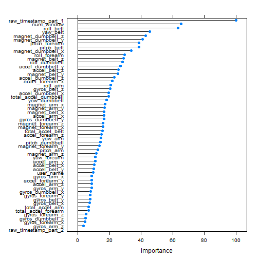

Practical Machine Learning Course Project
=========================================

Abstract
--------
Using devices such as Jawbone Up, Nike FuelBand, and Fitbit it is now possible to collect a large amount of data about personal activity relatively inexpensively. These type of devices are part of the quantified self movement - a group of enthusiasts who take measurements about themselves regularly to improve their health, to find patterns in their behavior, or because they are tech geeks. One thing that people regularly do is quantify how much of a particular activity they do, but they rarely quantify how well they do it. In this project, your goal will be to use data from accelerometers on the belt, forearm, arm, and dumbell of 6 participants. They were asked to perform barbell lifts correctly and incorrectly in 5 different ways. More information is available from the website here: http://groupware.les.inf.puc-rio.br/har (see the section on the Weight Lifting Exercise Dataset). 
Random forest method used

Read Dataset
------------


```r
pmlTraining <- read.csv("pml-training.csv", header = TRUE, na.strings = c("NA",""))
pmlTesting <- read.csv("pml-testing.csv", header = TRUE, na.strings = c("NA",""))
training       <- pmlTraining[,-c(1,5,6)]
test           <- pmlTesting[,-c(1,5,6)]
```

Analysis
--------

Split training set into secondary training set and test set


```r
library(caret)
trainingIndex  <- createDataPartition(training$classe, p=.50, list=FALSE)
training.train <- training[ trainingIndex,]
training.test  <- training[-trainingIndex,]
```

Next we create a function to remove entire NA columns, and apply it to both data frames. Lastly we create a function that removes any variables with missing NAs and apply this to the training set.

```r
rm.na.cols     <- function(x) { x[ , colSums( is.na(x) ) < nrow(x) ] }
training.train <- rm.na.cols(training.train)
training.test  <- rm.na.cols(training.test)
complete       <- function(x) {x[,sapply(x, function(y) !any(is.na(y)))] }
incompl        <- function(x) {names( x[,sapply(x, function(y) any(is.na(y)))] ) }
trtr.na.var    <- incompl(training.train)
trts.na.var    <- incompl(training.test)
training.train <- complete(training.train)
training.test  <- complete(training.test)
```

Method
------

Use Random Forests method by applying bagging to tree learners.


```r
library(randomForest)
```

```
## randomForest 4.6-10
## Type rfNews() to see new features/changes/bug fixes.
```

```r
random.forest <- train(training.train[,-57],
                       training.train$classe,
                       tuneGrid=data.frame(mtry=3),
                       trControl=trainControl(method="none")
                       )
```

Results
-------


```r
summary(random.forest)
```

```
##                 Length Class      Mode     
## call                4  -none-     call     
## type                1  -none-     character
## predicted        9812  factor     numeric  
## err.rate         3000  -none-     numeric  
## confusion          30  -none-     numeric  
## votes           49060  matrix     numeric  
## oob.times        9812  -none-     numeric  
## classes             5  -none-     character
## importance         56  -none-     numeric  
## importanceSD        0  -none-     NULL     
## localImportance     0  -none-     NULL     
## proximity           0  -none-     NULL     
## ntree               1  -none-     numeric  
## mtry                1  -none-     numeric  
## forest             14  -none-     list     
## y                9812  factor     numeric  
## test                0  -none-     NULL     
## inbag               0  -none-     NULL     
## xNames             56  -none-     character
## problemType         1  -none-     character
## tuneValue           1  data.frame list     
## obsLevels           5  -none-     character
```

Prediction Results vs Actual Data

```r
confusionMatrix(predict(random.forest,
                        newdata=training.test[,-57]),
                training.test$classe
                )
```

```
## Loading required package: randomForest
## randomForest 4.6-10
## Type rfNews() to see new features/changes/bug fixes.
```

```
## Confusion Matrix and Statistics
## 
##           Reference
## Prediction    A    B    C    D    E
##          A 2790    0    0    0    0
##          B    0 1898    3    0    0
##          C    0    0 1708   11    0
##          D    0    0    0 1597    3
##          E    0    0    0    0 1800
## 
## Overall Statistics
##                                         
##                Accuracy : 0.998         
##                  95% CI : (0.997, 0.999)
##     No Information Rate : 0.284         
##     P-Value [Acc > NIR] : <2e-16        
##                                         
##                   Kappa : 0.998         
##  Mcnemar's Test P-Value : NA            
## 
## Statistics by Class:
## 
##                      Class: A Class: B Class: C Class: D Class: E
## Sensitivity             1.000    1.000    0.998    0.993    0.998
## Specificity             1.000    1.000    0.999    1.000    1.000
## Pos Pred Value          1.000    0.998    0.994    0.998    1.000
## Neg Pred Value          1.000    1.000    1.000    0.999    1.000
## Prevalence              0.284    0.193    0.174    0.164    0.184
## Detection Rate          0.284    0.193    0.174    0.163    0.183
## Detection Prevalence    0.284    0.194    0.175    0.163    0.183
## Balanced Accuracy       1.000    1.000    0.998    0.996    0.999
```
Kappa statistic of 0.994 reflects the out-of-sample error.


```r
plot( varImp(random.forest) )
```

 
